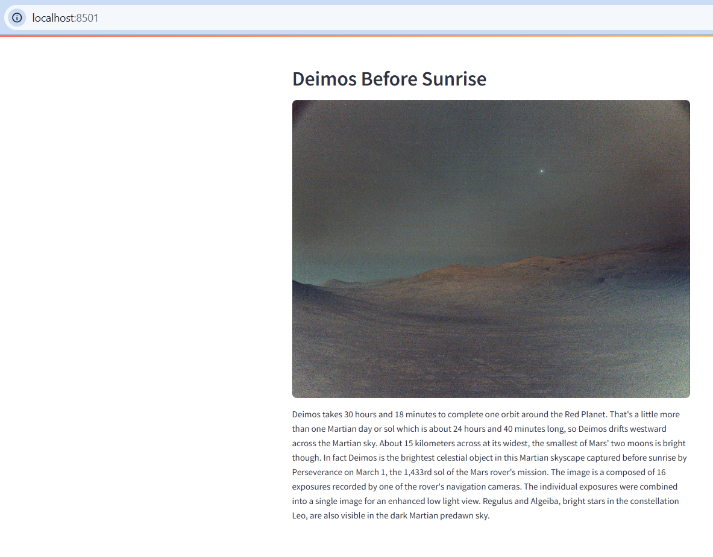

# NASA APOD Viewer 🌌

This is a simple Streamlit web app that displays NASA's **Astronomy Picture of the Day (APOD)** using the official [NASA APOD API](https://api.nasa.gov/).

## 🚀 Features

- Fetches the latest image from NASA's APOD API
- Displays the image title, photo, and its explanation
- Uses `.env` file to securely manage API keys

---

## 🧪 Tech Stack

- Python
- Streamlit
- Requests
- dotenv

---

## 📦 Requirements

Install dependencies:

```bash
pip install streamlit requests dotenv
```
Another way to install all dependencies from `requirements.txt`, anyone can simply run in the terminal from your project directory: 
```bash
pip install -r requirements.txt
```

---
## 🔐 Prerequisite for Environment Setup

To run this project, create a `.env` file in the root directory with the `api_key` parameter:

### .env file format:
```env 
api_key = "{your_nasa_api_key_here}"
```
---
## ▶️ Running the App
In the terminal, navigate to your project directory and run:

```bash
streamlit run main.py
```
---
## 📄 Example Output


